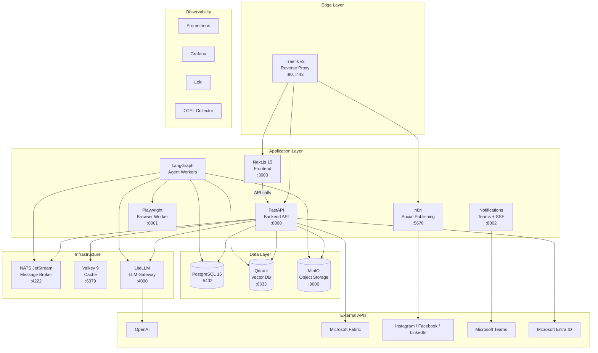
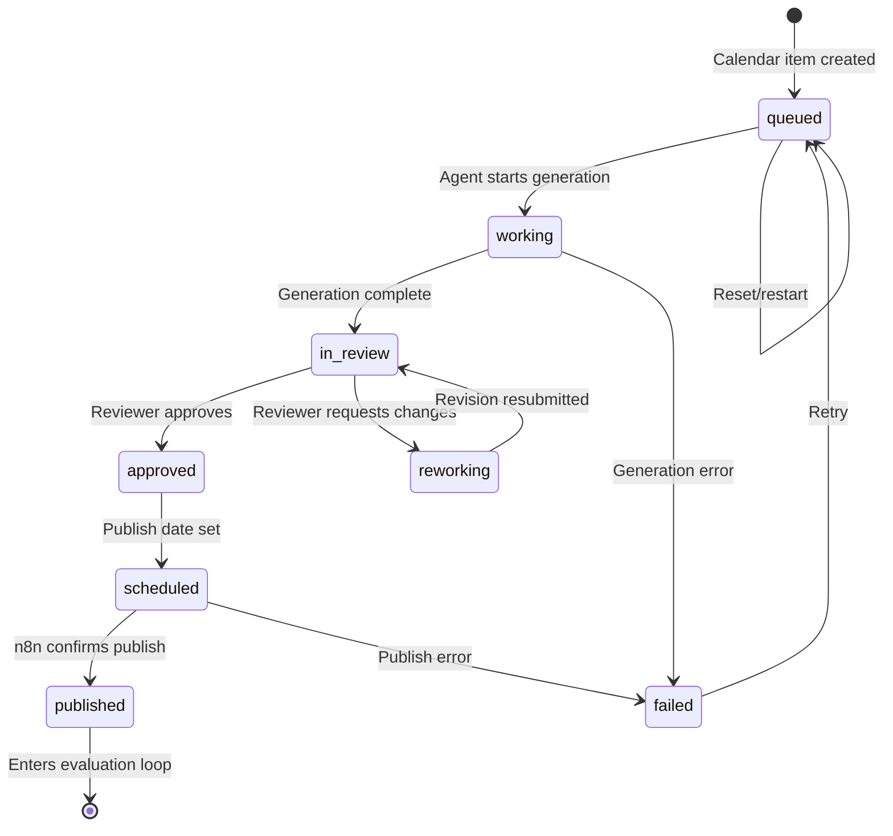
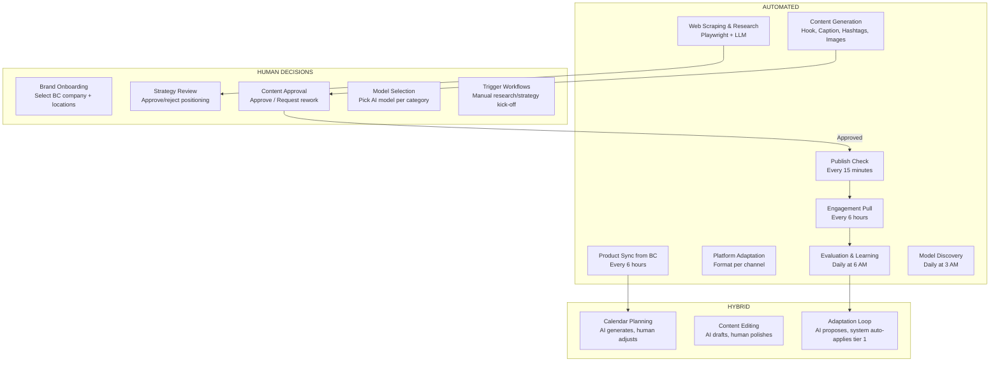
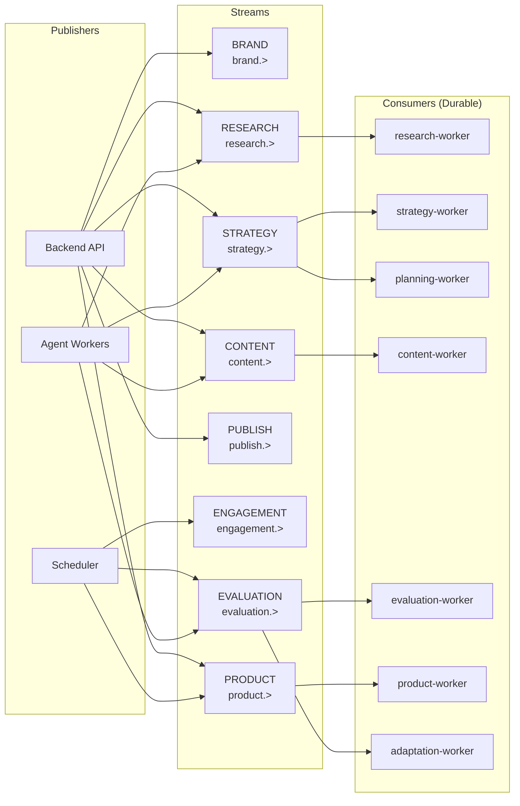

# MARKAI — System Architecture & Data Flow

**Generated:** March 24, 2026

---

## 1. Service Architecture — 16 Docker Services



---

## 2. Content Lifecycle — Status Flow



### Status Color Legend
| Status | Color | Meaning |
|--------|-------|---------|
| **Queued** | Slate | Planned, no work started |
| **Working** | Indigo | AI agents actively generating |
| **In Review** | Amber | Ready for human review |
| **Reworking** | Orange | Reviewer requested changes |
| **Approved** | Cyan | Passed review |
| **Scheduled** | Blue | Publish date/time set |
| **Published** | Green | Successfully posted |
| **Failed** | Red | Error in generation or publishing |

---

## 3. Automated vs Human Touchpoints



---

## 4. NATS JetStream — 8 Event Streams



---

## 5. Data Flow — Brand to Published Content

```
1. BRAND ONBOARDING
   User → POST /brands → Select BC Company → Select Locations → Brand Created

2. PRODUCT SYNC (automated, every 6h)
   Scheduler → Fabric SQL → Query items WHERE company = brand.bc_company
   → Filter by locations, exclude blocked, remaining_qty > 0
   → Upsert to products table

3. RESEARCH (triggered manually or on brand create)
   Backend → NATS research.trigger → Agent Worker
   → Crawl website (Playwright) → Analyze social → Analyze competitors
   → Store embeddings in Qdrant + results in PostgreSQL

4. STRATEGY (triggered after research)
   Backend → NATS strategy.trigger → Agent Worker
   → Generate positioning → Define pillars → Plan cadence
   → HUMAN INTERRUPT: Manager reviews and approves strategy

5. PLANNING (triggered after strategy approved)
   → Generate campaigns → Create calendar items → Assign products
   → Calendar items created with status: queued

6. CONTENT GENERATION (triggered per calendar item)
   Backend → NATS content.trigger → Agent Worker
   → Generate hook → Caption → Hashtags → Source product image
   → Generate background → Adapt for each platform
   → Store content version, set status: in_review

7. HUMAN REVIEW
   Reviewer sees items in Approvals queue
   → Approve → status: approved
   → Request rework → status: reworking → Creator revises → Resubmit

8. SCHEDULING
   Approved content gets scheduled_at timestamp
   → status: scheduled

9. PUBLISHING (automated, every 15min)
   Scheduler checks: calendar_items WHERE status=scheduled AND scheduled_at <= now()
   → Dispatch to n8n webhook → n8n posts to Instagram/Facebook/LinkedIn
   → n8n callback → status: published, set platform_post_id

10. ENGAGEMENT TRACKING (automated, every 6h)
    Pull metrics from social APIs → Store in engagement_metrics table

11. EVALUATION (automated, daily 6 AM)
    → Analyze patterns → Generate recommendations → Classify adaptations
    → Tier 1: Auto-apply  |  Tier 2/3: Human review

12. ADAPTATION (continuous)
    → Update prompt templates → Adjust thresholds → Feed into next cycle
```

---

## 6. Scheduler Jobs

| Job | Schedule | What it does |
|-----|----------|-------------|
| `morning_jobs` | Daily 6:00 AM | BC sync + Engagement pull + Evaluation trigger |
| `publish_checker` | Every 15 min | Dispatch due scheduled content to n8n |
| `engagement_puller` | Every 6 hours | Pull metrics from social platform APIs |
| `bc_sync` | Every 6 hours | Sync products from Fabric Lakehouse |
| `ai_model_discovery` | Daily 3:00 AM | Query OpenAI for available models |

---

## 7. Authentication Flow

```
Browser → NextAuth (Entra ID OAuth) → JWT token stored in session
  ↓
API Request → Bearer token in header
  ↓
FastAPI deps.py → HTTPBearer extracts token
  ↓
Dev mode (no token)? → Return dev-admin user (super admin)
  ↓
Production → Validate JWT via Entra ID JWKS → Extract oid/sub claim
  ↓
Lookup user in PostgreSQL (auto-provision on first login as viewer)
  ↓
Check role: admin > manager > editor > viewer
  ↓
Return 200 or 403
```

---

## 8. API Endpoint Map

| Prefix | Purpose | Auth Level |
|--------|---------|-----------|
| `/api/v1/dashboard` | Stats overview | viewer |
| `/api/v1/brands` | Brand CRUD + BC linking | manager (write), viewer (read) |
| `/api/v1/content` | Content + calendar items | editor (write), viewer (read) |
| `/api/v1/approvals` | Review queue + decisions | editor (create), manager (decide) |
| `/api/v1/calendar` | Calendar management | editor |
| `/api/v1/campaigns` | Campaign CRUD | manager |
| `/api/v1/analytics` | Engagement metrics | viewer |
| `/api/v1/products` | Product management + sync | manager |
| `/api/v1/prompts` | AI prompt templates | manager |
| `/api/v1/providers` | AI model selection | admin (write), viewer (read) |
| `/api/v1/system` | Health, jobs, queues, audit | manager |
| `/api/v1/users` | User management | admin |
| `/api/v1/intelligence` | Research/strategy triggers | manager |
| `/api/v1/learning` | Adaptations | viewer |
| `/api/v1/agents` | Agent run history | viewer |
| `/api/v1/notifications` | User notifications | viewer |
| `/api/v1/webhooks` | n8n callback | webhook secret |
| `/api/v1/audit` | Audit log | viewer |

---

## 9. External Dependencies

| Service | Protocol | Used By | Purpose |
|---------|----------|---------|---------|
| OpenAI | REST (via LiteLLM) | Agents, Backend | Text/image generation |
| Microsoft Fabric | SQL (pyodbc) | Backend | Product data from BC |
| Microsoft Entra ID | OAuth 2.0 + JWKS | Frontend, Backend | SSO authentication |
| Instagram Graph API | REST | n8n, Backend | Publish posts, pull metrics |
| Facebook Graph API | REST | n8n, Backend | Publish posts, pull metrics |
| LinkedIn API | REST | n8n, Backend | Publish posts, pull metrics |
| Microsoft Teams | Webhook | Notifications | Failure/approval alerts |
| DuckDuckGo | HTML scraping | Agents | Web search for research |

---

## 10. LangGraph Workflows — 7 Graphs

| Graph | Nodes | Human-in-Loop | Output |
|-------|-------|--------------|--------|
| `research` | 6 nodes | No | Qdrant embeddings + DB |
| `strategy` | 7 nodes | Yes (interrupt) | Strategy doc in DB |
| `planning` | 5 nodes | No | Calendar items |
| `content` | 8 nodes | No | Content versions + assets |
| `evaluation` | 5 nodes | No | Adaptations in DB |
| `product_intel` | 5 nodes | No | Product insights |
| `adaptation` | 4 nodes | Tier 2/3 (interrupt) | Updated prompts/thresholds |
